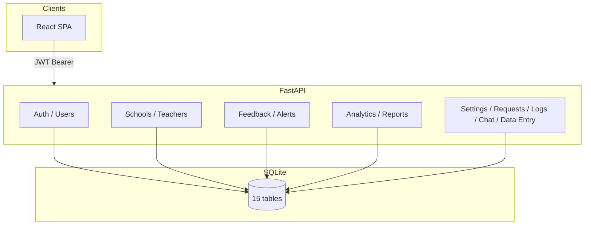
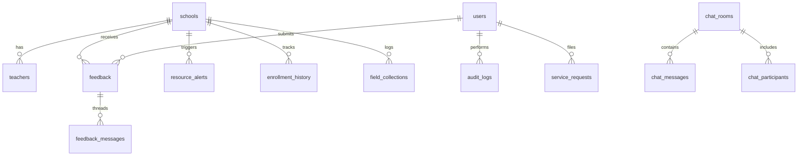

# ECRM — Education Community Resource Mapping

National web platform for mapping public schools, tracking educational resources, and coordinating interventions across Rwanda’s 30 districts. The system combines geospatial visualisation, role-based workflows, automated resource-gap detection, and audit-ready reporting for the Rwanda Education Board (REB), district officers, schools, field staff, and community members.

**Stack:** FastAPI · SQLAlchemy · SQLite · React · Vite · Leaflet · JWT

| Environment | URL |
|-------------|-----|
| API (dev) | `http://localhost:8000` |
| API docs | `http://localhost:8000/api/docs` |
| Frontend (dev) | `http://localhost:5173` |

---

## 1. Problem Statement

Rwanda’s education sector lacks a single, authoritative view of school conditions nationwide. Decision-makers face fragmented data: enrollment counts, infrastructure, teacher deployment, and community complaints live in separate spreadsheets or paper records. Specific gaps include:

- **No unified school registry** with GPS coordinates and facility status across all districts.
- **No automated gap detection** for textbooks, desks, sanitation, teacher overload, or missing utilities.
- **Weak accountability loops** between community reports, district action, and national oversight.
- **Limited geospatial tooling** for field verification and regional equity analysis.
- **Manual user provisioning** without self-registration, approval workflows, or support ticketing.
- **No audit trail** tying data changes and officer actions to identifiable users and timestamps.

ECRM addresses these by centralising school records, enforcing role-scoped access, generating alerts from live data, and providing dashboards, reports, and maps aligned to each actor’s mandate.

---

## 2. Solution Overview

ECRM delivers an integrated operational system with six capability areas:

| Capability | Description |
|------------|-------------|
| **School registry** | CRUD for schools with enrollment, infrastructure, resources, and GPS; auto-computed status (good / moderate / critical). |
| **GIS mapping** | Leaflet map with status-coded markers, GPS capture/verification, GeoJSON export. |
| **Resource intelligence** | Auto-generated alerts, gap analysis, risk scores, district analytics, PDF reports. |
| **Case management** | Community/school feedback with threaded messages, district review, forward-to-REB workflow. |
| **Field data collection** | School-head data entry (survey, infrastructure, resources, enrollment, teacher census) with collection history. |
| **Governance** | Self-registration with admin approval, user provisioning, service requests, platform settings, audit logs, team chat. |

Authorization is enforced on every API route. The frontend mirrors backend rules via route guards and `frontend/src/utils/permissions.js`.

---

## 3. Actors and Responsibilities

| Role | Actor | Scope | Primary responsibilities |
|------|-------|-------|--------------------------|
| **admin** | System administrator | National | User provisioning, registration approval, platform settings, audit logs, service-request resolution, national oversight. |
| **reb** | REB officer | National | National GIS and analytics, school/teacher oversight, feedback forwarded from districts, alert resolution, reports, chat. |
| **district** | District education officer | One district | District schools and teachers, feedback review, alert resolution/forward, resources view, district reports and gap analysis. |
| **school** | School head | One school | Own school profile, data entry, teacher roster, feedback, resource inventory (read-only), enrollment history, service requests. |
| **enumerator** | Field enumerator | One district | Register schools, capture/verify GPS, field map, GPS coverage reports. |
| **community** | Community member | District (optional) | Submit and track feedback, view school map, community feedback reports. |

### Account lifecycle

1. **Self-registration** (`POST /api/auth/register`) — community accounts can be auto-approved per platform setting; other roles enter a pending queue.
2. **Admin approval** (`POST /api/users/{id}/approve|reject`) — assigns role, district, and school scope.
3. **Admin provisioning** (`POST /api/users/`) — direct creation with validated scope.
4. **Service requests** — non-admin users request role fixes, data corrections, or account unlocks; admin resolves via `PATCH /api/requests/{id}`.

---

## 4. Process and Data Flow

### 4.1 School data lifecycle

```
Enumerator/Admin/District → POST /api/schools (register)
School head → Data Entry → PATCH /api/schools/{id} (update counts, facilities, resources)
                          → POST /api/data-entry/ (collection log)
                          → EnrollmentHistory upsert on count change
System → auto-compute status + regenerate ResourceAlerts on each school update
```

### 4.2 Feedback and alerts

```
Community/School → POST /api/feedback (+ initial message)
District → PATCH status, POST messages, POST forward (to REB)
REB → PATCH / resolve forwarded items
System → ResourceAlerts from school metrics (textbooks, desks, toilets, P:T ratio, water, GPS)
District/REB → PATCH /api/alerts/{id}/resolve, POST forward, POST reopen
```

### 4.3 Insight and reporting

```
Scoped school data → GET /api/analytics/* (national, districts, gaps, trends, GIS, risk scores)
                  → GET /api/reports/types|preview|export (role-filtered PDF)
Platform settings (equity weights) → GET /api/analytics/equity-weights → Gap Analysis UI
```

### 4.4 High-level architecture



### 4.5 Navigation model (frontend)

- **Sidebar:** role-specific menu with grouped sections (Education, Users, Insights, System, School ops, etc.). Groups expand on click or hover; child routes use the same styling as top-level items.
- **Topbar:** page title with breadcrumb for active group (e.g. `School ops · Data Entry`) and a secondary tab row for sibling routes within that group.
- **User menu:** Profile, Settings (theme), Sign out. Non-admins access service requests from Settings or the More group.

---

## 5. Database Structure

SQLite database (`ecrm.db`), auto-created via `ensure_schema()`. Fifteen logical tables:

### 5.1 Entity relationship summary



### 5.2 Tables

| Table | Purpose | Key fields |
|-------|---------|------------|
| `schools` | Master school record | district, sector, GPS, enrollment, infrastructure flags, resources, `status` |
| `users` | Authentication and RBAC | `role`, `district`, `school_id`, `account_status`, phone, organization |
| `teachers` | Per-school roster | school_id, subject, qualification, employment_type |
| `feedback` | Community/school issues | school_id, issue_type, status, forwarded_to_reb |
| `feedback_messages` | Feedback thread | feedback_id, user_id, content |
| `resource_alerts` | Auto-generated gaps | school_id, alert_type, level, is_resolved |
| `enrollment_history` | Term/year snapshots | school_id, year, term, student/teacher counts |
| `field_collections` | Data-entry audit log | school_id, user_id, collection_type, notes |
| `service_requests` | Support tickets | user_id, request_type, status, admin_note |
| `system_settings` | Platform config | key, value (equity weights, password rules, auto-approve) |
| `audit_logs` | Compliance trail | user_id, action_type, entity, ip_address |
| `chat_rooms` | Team chat rooms | scope, district, target_role |
| `chat_participants` | Room membership | room_id, user_id |
| `chat_messages` | Chat content | room_id, reply_to_id |
| `password_reset_otps` | Password reset flow | email, otp_hash, expires_at |

### 5.3 School status computation

Status derives from eight criteria: water, electricity, toilet ratio, textbook ratio, desk ratio, classroom ratio, library, GPS verified. Score ≥ 6 → good; ≥ 3 → moderate; else critical. Updates trigger alert regeneration.

### 5.4 Seed data

```bash
cd backend && python -m app.seeds.seed
```

Typical seed volume: ~390 schools (30 districts), ~2,000 teachers, ~150 feedback records, auto-generated alerts, enrollment history rows, demo users, and chat rooms.

---

## 6. API Reference

Base path: `/api`. Authentication: `Authorization: Bearer <JWT>` unless marked Public.

Pagination: list endpoints accept `skip` and `limit` (default limit 50).

### 6.1 Health and meta

| Method | Path | Access | Description |
|--------|------|--------|-------------|
| GET | `/api/health` | Public | Service health check |
| GET | `/api/meta/districts` | Public | Rwanda district metadata |
| GET | `/api/meta/stats` | Public | Live school/teacher/district counts |

### 6.2 Authentication

| Method | Path | Access | Description |
|--------|------|--------|-------------|
| POST | `/api/auth/login` | Public | Login; returns JWT |
| POST | `/api/auth/register` | Public | Self-registration |
| GET | `/api/auth/me` | Authenticated | Current user profile |
| PATCH | `/api/auth/me` | Authenticated | Update name, phone, organization |
| POST | `/api/auth/logout` | Authenticated | Logout (audit entry) |
| POST | `/api/auth/forgot-password` | Public | Request OTP (dev returns `dev_otp`) |
| POST | `/api/auth/reset-password` | Public | Reset with OTP |
| POST | `/api/auth/change-password` | Authenticated | Change password |

### 6.3 Users (admin)

| Method | Path | Description |
|--------|------|-------------|
| GET | `/api/users/` | List users (filter, paginate) |
| POST | `/api/users/` | Provision user |
| PATCH | `/api/users/{id}` | Update user / reassign scope |
| DELETE | `/api/users/{id}` | Delete user |
| GET | `/api/users/pending` | Pending registrations |
| POST | `/api/users/{id}/approve` | Approve registration |
| POST | `/api/users/{id}/reject` | Reject registration |
| GET | `/api/users/assignment-gaps` | Schools/districts without assigned officers |

### 6.4 Schools

| Method | Path | Access | Description |
|--------|------|--------|-------------|
| GET | `/api/schools/count` | Authenticated | Scoped count |
| GET | `/api/schools/` | Authenticated | List (role-scoped) |
| POST | `/api/schools/` | admin, district, enumerator | Register school |
| GET | `/api/schools/{id}` | Authenticated | School detail |
| PATCH | `/api/schools/{id}` | admin, district, enumerator, school | Update school |
| PATCH | `/api/schools/{id}/verify-gps` | district, enumerator | Verify GPS on site |
| DELETE | `/api/schools/{id}` | admin, district | Delete school |
| GET | `/api/schools/export/csv` | Authenticated | CSV export (community excluded) |
| GET | `/api/schools/export/geojson` | Authenticated | GeoJSON export |

### 6.5 Teachers

| Method | Path | Access | Description |
|--------|------|--------|-------------|
| GET | `/api/teachers/count` | Authenticated | Scoped count |
| GET | `/api/teachers/` | Authenticated | List teachers |
| POST | `/api/teachers/` | admin, district, school | Add teacher |
| PATCH | `/api/teachers/{id}` | admin, district, school | Update teacher |
| DELETE | `/api/teachers/{id}` | admin, district, school | Remove teacher |
| GET | `/api/teachers/workload/analysis` | Authenticated | P:T workload analysis |

### 6.6 Feedback

| Method | Path | Access | Description |
|--------|------|--------|-------------|
| GET | `/api/feedback/count` | Authenticated | Scoped count |
| GET | `/api/feedback/` | Authenticated | List feedback |
| POST | `/api/feedback/` | community, school | Submit issue |
| PATCH | `/api/feedback/{id}` | reb, district | Update status |
| POST | `/api/feedback/{id}/forward` | district | Forward to REB |
| POST | `/api/feedback/{id}/reopen` | reb, district | Reopen case |
| GET | `/api/feedback/{id}/messages` | Authenticated | Thread messages |
| POST | `/api/feedback/{id}/messages` | Authenticated | Add message |

### 6.7 Alerts

| Method | Path | Access | Description |
|--------|------|--------|-------------|
| GET | `/api/alerts/count` | Authenticated | Scoped count |
| GET | `/api/alerts/` | Authenticated | List alerts |
| PATCH | `/api/alerts/{id}/resolve` | reb, district | Resolve alert |
| POST | `/api/alerts/{id}/forward` | district | Forward to REB |
| POST | `/api/alerts/{id}/reopen` | reb, district | Reopen alert |

### 6.8 Analytics

| Method | Path | Access | Description |
|--------|------|--------|-------------|
| GET | `/api/analytics/national` | admin, reb | National KPIs |
| GET | `/api/analytics/districts` | Authenticated | Per-district stats (role-scoped) |
| GET | `/api/analytics/resource-gaps` | Authenticated | Textbook/desk/toilet/classroom gaps |
| GET | `/api/analytics/resource-inventory` | Authenticated | Per-school resource lines |
| GET | `/api/analytics/teacher-coverage` | Authenticated | Teacher coverage metrics |
| GET | `/api/analytics/enrollment-trends` | Authenticated | Historical enrollment |
| GET | `/api/analytics/gis-summary` | Authenticated | GPS coverage (role-scoped) |
| GET | `/api/analytics/risk-scores` | Authenticated | Intervention priority scores |
| GET | `/api/analytics/equity-weights` | Authenticated | Gap-analysis weights from settings |

### 6.9 Reports

| Method | Path | Access | Description |
|--------|------|--------|-------------|
| GET | `/api/reports/types` | Authenticated | Role-filtered report catalog |
| GET | `/api/reports/preview` | Authenticated | Tabular preview |
| GET | `/api/reports/export` | Authenticated | PDF export |

Report types: `schools_summary`, `alerts_summary`, `feedback_summary`, `enrollment_trends`, `gps_coverage`, `district_overview`.

### 6.10 Data entry

| Method | Path | Access | Description |
|--------|------|--------|-------------|
| GET | `/api/data-entry/` | school, district, enumerator, admin | Collection history |
| POST | `/api/data-entry/` | school, district, enumerator, admin | Record collection submission |

Collection types: `survey`, `infra`, `teachers`, `resources`, `enrollment`.

### 6.11 Service requests

| Method | Path | Access | Description |
|--------|------|--------|-------------|
| GET | `/api/requests/` | Authenticated | List (admin: all; others: own) |
| POST | `/api/requests/` | Non-admin | Submit request |
| PATCH | `/api/requests/{id}` | admin | Resolve / approve / reject |

### 6.12 Enrollment, logs, settings, system, chat

| Method | Path | Access | Description |
|--------|------|--------|-------------|
| GET | `/api/enrollment/{school_id}` | Authenticated | Enrollment history |
| GET | `/api/logs/` | admin | Audit logs |
| GET | `/api/settings/` | admin | Platform settings |
| PATCH | `/api/settings/{key}` | admin | Update setting |
| GET | `/api/system/health-stats` | admin | Dashboard health KPIs |
| GET | `/api/chat/presets` | reb, district | Room presets |
| GET/POST | `/api/chat/rooms` | Authenticated | List / create rooms |
| GET | `/api/chat/contacts` | Authenticated | Messaging contacts |
| POST | `/api/chat/direct/{user_id}` | Authenticated | Direct message room |
| GET/POST | `/api/chat/rooms/{id}/messages` | Authenticated | Messages |

---

## 7. Role Capability Matrix

| Action | admin | reb | district | school | enumerator | community |
|--------|:-----:|:---:|:--------:|:------:|:----------:|:---------:|
| National analytics | ✓ | ✓ | — | — | — | — |
| Register school | ✓ | — | ✓ | — | ✓ | — |
| Edit own school | ✓ | — | ✓ | ✓ | — | — |
| Data entry | — | — | — | ✓ | — | — |
| Submit feedback | — | — | — | ✓ | — | ✓ |
| Review/forward feedback | — | ✓ | ✓ | — | — | — |
| Resolve alerts | — | ✓ | ✓ | — | — | — |
| Manage teachers | ✓ | — | ✓ | ✓ | — | — |
| Verify GPS | — | — | ✓ | — | ✓ | — |
| PDF reports | ✓ | ✓ | ✓ | ✓ | ✓ | partial |
| User provisioning | ✓ | — | — | — | — | — |
| Submit service request | — | ✓ | ✓ | ✓ | ✓ | ✓ |
| Resolve service request | ✓ | — | — | — | — | — |
| Platform settings | ✓ | — | — | — | — | — |
| Audit logs | ✓ | — | — | — | — | — |

Frontend enforcement: `frontend/src/utils/permissions.js` and `ROUTE_ROLES` in `App.jsx`.

---

## 8. Project Structure

```
ecrm/
├── backend/
│   ├── app/
│   │   ├── core/           config, database, security (JWT, RBAC, role_str)
│   │   ├── models/         SQLAlchemy ORM (models.py)
│   │   ├── routes/         Feature routers (auth, schools, teachers, feedback,
│   │   │                   alerts, analytics, reports, chat, logs, settings,
│   │   │                   requests, data_entry, meta, system)
│   │   ├── schemas/        Pydantic request/response models
│   │   ├── services/       school_scope, metrics, settings, PDF, user_scope
│   │   ├── seeds/          Database seed script
│   │   └── main.py         FastAPI application entry
│   ├── requirements.txt
│   └── .env.example
├── frontend/
│   ├── src/
│   │   ├── api/api.js      HTTP client (Axios + JWT interceptor)
│   │   ├── config/         navConfig.js (role menus, breadcrumbs)
│   │   ├── components/     UI, GISMap, SidebarNav, TopbarSecondaryNav
│   │   ├── pages/          Feature pages (DashboardRouter, DataEntryPage, …)
│   │   ├── store/          auth.js, theme.js
│   │   └── utils/          permissions.js, schoolMetrics, format
│   ├── package.json
│   └── .env.example
└── README.md
```

---

## 9. Known Limitations

| Area | Current state | Planned direction |
|------|---------------|-----------------|
| Password reset | OTP returned in API response for development | SMTP integration |
| JWT logout | Audit log only; token not invalidated server-side | Token denylist |
| Alert resolution notes | Stored in audit log, not on alert row | Persist on `resource_alerts` |
| Email notifications | Not implemented | Event-driven notifications |
| Database migrations | `create_all` only; no Alembic | Formal migration tool |
| Offline sync | Not supported | Mobile / PWA sync layer |

---

## 10. Installation

### Prerequisites

Python 3.10+, Node.js 18+, Git.

### Backend

```bash
cd backend
pip install -r requirements.txt
cp .env.example .env
# Set SECRET_KEY in .env (generate: python -c "import secrets; print(secrets.token_urlsafe(32))")
python -m app.seeds.seed
uvicorn app.main:app --reload --port 8000
```

### Frontend

```bash
cd frontend
npm install
cp .env.example .env
npm run dev
```

### Environment variables

**Backend (`backend/.env`)**

```
ENV=development
DATABASE_URL=sqlite:///./ecrm.db
SECRET_KEY=<required>
ALGORITHM=HS256
ACCESS_TOKEN_EXPIRE_MINUTES=120
CORS_ORIGINS=http://localhost:5173,http://localhost:3000
RATE_LIMIT_REQUESTS=100
RATE_LIMIT_WINDOW=60
```

**Frontend (`frontend/.env`)**

```
VITE_API_URL=http://localhost:8000
```

---

## 11. Demo Accounts

| Role | Email | Password |
|------|-------|----------|
| System Administrator | admin@reb.rw | Admin@1234 |
| REB Officer | uwase@mineduc.gov.rw | Reb@1234 |
| District Officer | eric@gasabo.gov.rw | District@1 |
| School Head | paul@school.rw | School@1234 |
| Field Enumerator | rose@reb.rw | Field@1234 |
| Community Member | david@gmail.com | Comm@1234 |

---

## 12. Production Deployment

1. Set `DATABASE_URL` to PostgreSQL (or managed SQL).
2. Generate a strong `SECRET_KEY`; restrict `CORS_ORIGINS` to your domain.
3. Build frontend: `cd frontend && npm run build`.
4. Serve `frontend/dist` via nginx or static middleware behind HTTPS.
5. Run API with a production ASGI server (e.g. gunicorn + uvicorn workers).

---

## 13. Licence and Context

Developed for education resource mapping in Rwanda. For API exploration, use the interactive documentation at `/api/docs` when the backend is running.
